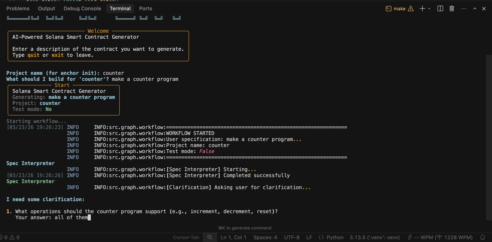
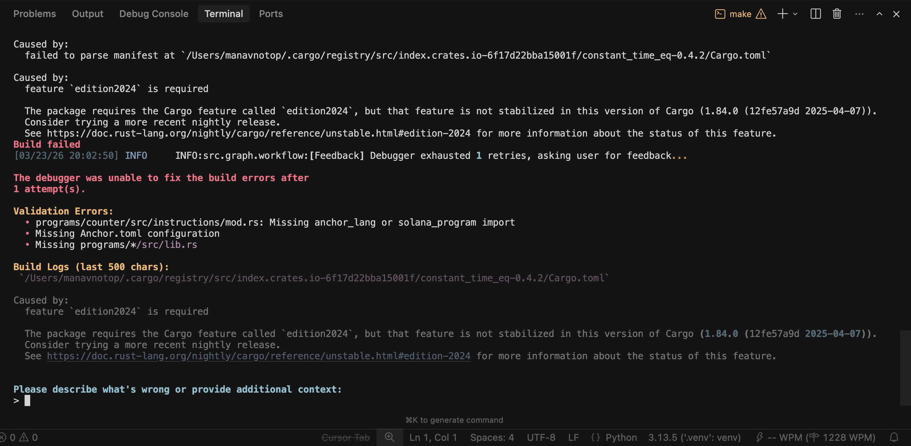

# Assignment Completion Report

## Assignment Received

I was given the following two tasks to implement human-in-the-loop capabilities in the smart-contractor project:

### Task 1: Plan Mode - Clarification During Planning

**Objective**: Enhance the plan mode so that when the agent feels it needs clarification on certain aspects, it can ask the user for suggestions or inputs. This should work similarly to how OpenCode or Claude Code operate - when in plan mode, the agent asks the user for clarifications in an interactive way.

**Implementation**: Added a `clarification_node` in the workflow that:
- Detects when the spec_interpreter identifies unclear requirements
- Asks the user specific questions to gather necessary details
- Enriches the user specification with the answers provided
- Loops back to the spec_interpreter with the clarified requirements

**Output Preview**:


---

### Task 2: Feedback Mode - User Input After Debugger Exhausts Retries

**Objective**: After the debugger agent runs for the maximum number of retries (defined by the `MAX_RETRIES` variable), the user should have the option to provide input explaining what the issue might be and why the code could not build. Based on this feedback, the agent should be able to run again and attempt to fix the issues.

**Implementation**: Added a `feedback_node` in the workflow that:
- Triggers after the debugger exhausts all retries (`retry_count >= MAX_RETRIES`)
- Displays the validation errors, build logs, and error messages to the user
- Prompts the user for free-form text feedback describing the issue
- Resets `retry_count` to 0 so the debugger can attempt fixes again
- Passes the user's feedback to the debugger agent for context

The debugger was also updated to include user feedback in its prompt, allowing it to use the additional context on its next attempt.

**Output Preview**:


---

## Technical Details

### Files Modified

| File | Changes |
|------|---------|
| `src/schemas/models.py` | Added `user_feedback` field to `GraphState` |
| `src/graph/workflow.py` | Added `feedback_node`, modified conditional edges, fixed retry count bug |
| `src/agents/debugger.py` | Updated to include user feedback in error analysis prompt |

### New Workflow Flow

```
                    ┌──────────────────────────────────────┐
                    │                                      │
              ┌─────▼─────┐                         ┌──────┴──────┐
              │  static  │                         │   abort     │
              │validator │                         └─────────────┘
              └─────┬─────┘
                    │
           ┌────────┼────────┐
           │        │        │
      "build"  "debugger" "feedback"   ← New conditional path
           │        │        │
           │   ┌────▼────┐   │
           │   │debugger │◄──┘
           │   └────┬────┘
           │        │
           │   ┌────▼────┐
           │   │ build   │
           │   │contract │
           │   └────┬────┘
           │        │
      "end"│   "debugger"│"abort"
           │        │      │
           └────────┼──────┘
                    │
              "feedback"    
                    │
              ┌────▼────┐
              │feedback │
              │  node   │
              └────┬────┘
                   │ (reset retry_count=0)
                   └─► "debugger" (retry with user feedback)
```

### Retry Logic

1. Debugger runs → fails → `retry_count` increments
2. If `retry_count < MAX_RETRIES` → debugger runs again
3. If `retry_count >= MAX_RETRIES` and `user_feedback is None` → ask user for feedback
4. User provides feedback → `retry_count` resets to 0 → debugger runs with user context
5. If it fails again → repeat from step 2

This gives the user unlimited opportunities to provide feedback, with each "session" bounded by MAX_RETRIES.

---

## Bug Fix

Fixed a bug where `retry_count` was being incremented in both `_run_agent_node` and `debugger_node`, causing the debugger to exhaust its retries twice as fast. Now only `debugger_node` increments the retry count.

---

## Testing

To test these features:

```bash
# Test Task 1 - Clarification mode
# Provide a vague spec that triggers clarification questions

# Test Task 2 - Feedback mode
# The debugger will automatically ask for feedback after MAX_RETRIES
# Set MAX_RETRIES=1 in src/schemas/models.py for easier testing
```

---

## Completion Status

- [x] Task 1: Plan Mode Clarification - Implemented
- [x] Task 2: Feedback Mode After Debugger - Implemented
- [x] Bug Fix: Retry count double increment - Fixed
- [x] Code Linting - Passed

---

**Date Completed**: March 2026
